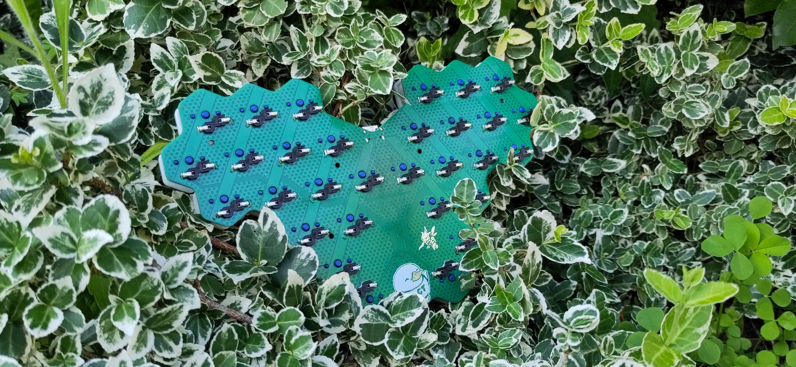

# Hexapoda
The Hexapoda is a [hummingbird](https://github.com/PJE66/hummingbird) style 30 key keyboard designed around [hexagonal keycaps](https://hw.s-ol.nu/HEX-keycaps/), which require Choc v1 switches.
It uses the CH552T controller and [FAK firmware](https://github.com/semickolon/fak).

The electronic design is inspired by the [MIAO MCU board](https://github.com/kilipan/miao).
